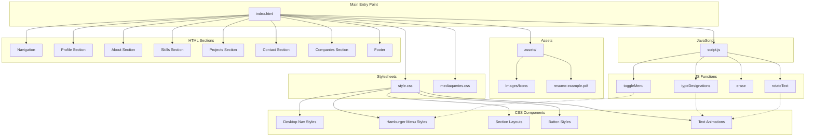

# Personal Portfolio - Architecture Diagram

## Project Overview
A single-page personal portfolio website for Muhammed Navas, Senior Document Controller, built with vanilla HTML, CSS, and JavaScript.

## File Structure

```
personal_portfolio/
├── index.html              # Main HTML structure
├── style.css               # Primary stylesheet
├── mediaqueries.css        # Responsive design breakpoints
├── script.js               # Interactive functionality
├── README.md               # Project documentation
└── assets/                 # Images, icons, and documents
    ├── profile-pic.png     # Profile photo
    ├── about-pic.png       # About section photo
    ├── resume-example.pdf  # Resume/CV
    ├── project-*.png       # Project screenshots
    ├── *.png               # Skill/tool icons
    └── company logos       # Partner/stakeholder logos
```

## Architecture Diagram



## Component Relationships

### HTML Structure Flow
```
index.html
├── <head>
│   ├── style.css (Main styles)
│   └── mediaqueries.css (Responsive styles)
├── <body>
│   ├── Desktop Navigation (#desktop-nav)
│   ├── Hamburger Navigation (#hamburger-nav)
│   ├── Profile Section (#profile)
│   ├── About Section (#about)
│   ├── Skills Section (#experience)
│   ├── Projects Section (#projects)
│   ├── Contact Section (#contact)
│   ├── Companies Section
│   ├── Footer
│   └── script.js
```

### CSS Architecture
```
style.css
├── General Styles
│   ├── Font imports (Poppins)
│   ├── Reset (margin/padding)
│   └── Base styles (body, html, p)
├── Navigation
│   ├── Desktop nav layout
│   └── Hamburger menu with animations
├── Sections
│   ├── Profile section
│   ├── About section
│   ├── Skills/Experience section
│   ├── Projects section
│   └── Contact section
├── Components
│   ├── Buttons (btn-color-1, btn-color-2)
│   ├── Icons
│   └── Cards/Containers
└── Animations
    ├── Rolling text
    └── Rotating text

mediaqueries.css
├── @media (max-width: 1400px)
├── @media (max-width: 1200px)
└── @media (max-width: 600px)
```

### JavaScript Functionality
```
script.js
├── toggleMenu()
│   ├── Toggles .menu-links.open class
│   └── Toggles .hamburger-icon.open class
├── Designation Animation
│   ├── typeDesignations(index)
│   │   ├── type() - Types characters one by one
│   │   └── erase() - Erases characters one by one
│   └── Array of 14 job titles
└── Rotating Text Animation
    ├── Splits words into letters
    ├── Creates span elements for each letter
    ├── rotateText() - Rotates between words
    └── Runs every 3 seconds
```

## Data Flow

### User Interaction Flow
```
User Action → HTML Element → JavaScript Event → DOM Manipulation → CSS Update
```

**Example: Hamburger Menu**
```
User clicks hamburger icon 
→ onclick="toggleMenu()" 
→ JS toggles .open class on menu-links and hamburger-icon 
→ CSS transitions menu from max-height: 0 to max-height: 300px
→ Menu becomes visible
```

### Responsive Design Flow
```
Viewport Size Change → Media Query Match → CSS Rule Application → Layout Update
```

**Breakpoints:**
- **> 1400px**: Full desktop layout
- **1200px - 1400px**: Adjusted spacing, wrapped containers
- **600px - 1200px**: Hamburger menu appears, stacked layout
- **< 600px**: Mobile-first layout, smaller fonts, wrapped elements

## Key Features

### 1. Dual Navigation System
- **Desktop**: Horizontal nav bar with links
- **Mobile**: Hamburger menu with toggle functionality
- Controlled by media queries at 1200px breakpoint

### 2. Animated Job Titles
- 14 different job titles cycle through
- Typing effect (100ms per character)
- Erasing effect (50ms per character)
- 1-second pause between titles

### 3. Skills Display
- **Technical Skills**: 18 tool icons (Oracle Aconex, MS Office, Power BI, etc.)
- **Professional Skills**: 16 text-based skills
- Organized in two-column grid layout

### 4. Projects Showcase
- 5 project cards with images
- Each project has action buttons:
  - LinkedIn profile link
  - Download CV
  - Hire Me (email)
  - WhatsApp Me
  - Call Me

### 5. Contact Methods
- 2 email addresses
- LinkedIn profile
- WhatsApp link
- Phone number

### 6. Companies Section
- 26 company logos displayed in grid
- Shows key project stakeholders and partners
- Responsive flexbox layout

## Technology Stack

- **HTML5**: Semantic markup
- **CSS3**: Styling with Flexbox, transitions, animations
- **JavaScript (ES6)**: DOM manipulation, event handling
- **No frameworks**: Pure vanilla implementation
- **Google Fonts**: Poppins font family
- **External links**: LinkedIn, GitHub, YouTube, WhatsApp

## Performance Considerations

- Single-page application (no page reloads)
- Smooth scroll behavior
- CSS transitions for animations (GPU accelerated)
- Lazy loading not implemented (images load immediately)
- No external dependencies (except Google Fonts)

## Accessibility

- Semantic HTML structure
- Alt text on images
- Keyboard navigable (hamburger menu)
- Responsive design for all screen sizes
- High contrast text (dark gray on white)
